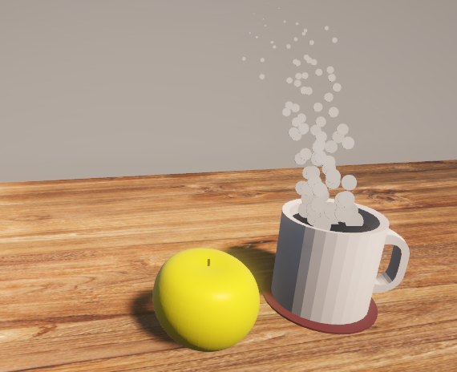

# Purpose

Create a still life scene

# Contents

The game scene will just be a still shot of looking at the scene from the chosen camera angle.

The still life will be made up of a wooden table with a mug of steaming coffee and an apple.

# Objectives

1. use blender to create all models
1. manually create most materials

# Result

